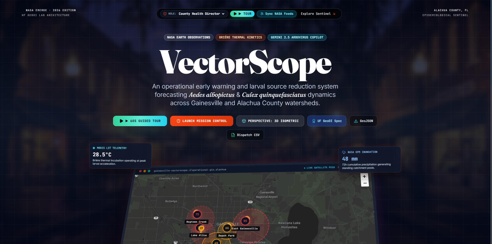

<div align="center">

# 🛰️ VectorScope
### Enterprise Operational Epidemiological Early Warning & Larval Source Reduction GIS Engine
**CityCamp Gainesville Hack Day — NASA EMERGE Track**  
*Aligned with University of Florida (UF) GeoDI Lab & Florida Community Innovation Research Specifications*

<br/>

[](https://fastapi.tiangolo.com/)
[](https://leafletjs.com/)
[](https://earthdata.nasa.gov/)
[](https://www.atsdr.cdc.gov/placeandhealth/svi/index.html)
[](https://python.org)
[](https://docker.com)
[](https://ai.google.dev/)
[](LICENSE)

<br/>

<p align="center">
  <a href="#-executive-summary">Executive Summary</a> •
  <a href="#-system-architecture">Architecture</a> •
  <a href="#-mathematical-formulation">Mathematical Model</a> •
  <a href="#-core-capabilities">Capabilities</a> •
  <a href="#-role-based-access-control-rbac">RBAC Personas</a> •
  <a href="#-quickstart--deployment">Quickstart</a> •
  <a href="#-api-reference">API Spec</a>
</p>

<p align="center">
  
</p>

---

</div>

## 🔬 Executive Summary

**VectorScope** is an operational, mission-critical epidemiological GIS platform engineered for municipal mosquito control districts, county health departments, and disease ecology research centers. It continuously monitors, forecasts, and preemptively disrupts vector reproduction cycles for:

* **_Aedes albopictus_** (Asian Tiger Mosquito) — Primary vector for Dengue, Chikungunya, and Zika.
* **_Culex quinquefasciatus_** (Southern House Mosquito) — Vector for West Nile Virus (WNV) and St. Louis Encephalitis (SLEV).

By bridging high-resolution **NASA Earth Observations** (MODIS LST, GPM Precipitation, Landsat-9 OLI-2) with **NASA GLOBE Observer** citizen science field observations and the **CDC Social Vulnerability Index (SVI)**, VectorScope eliminates the classic 14-day optical canopy blindspot, rebalances intervention priorities toward historically underserved communities, and equips municipal directors with predictive AI dispatch recommendations.

---

## 🏛️ System Architecture

The system operates across a decoupled, containerized enterprise architecture featuring an asynchronous background ETL pipeline, a secure FastAPI gateway, and a high-performance Leaflet telemetry command console:

```
====================================================================================================
                                      VECTORSCOPE SYSTEM TOPOLOGY
====================================================================================================

      EXTERNAL DATA FEEDS                           ENTERPRISE BACKEND SERVICE (:8000)
 +---------------------------+                 +-----------------------------------------------+
 |  NASA CMR STAC API        |                 |  FastAPI Microservice (Uvicorn / Python 3.11) |
 |  - MODIS LST (MOD11A1)    |=== HTTP/JSON ==>|  +-----------------------------------------+  |
 |  - NASA GPM IMERG (3IMERG)|                 |  | APScheduler Background ETL Worker       |  |
 |  - Landsat-9 OLI-2        |                 |  | - 24-Hour Recurrent STAC Query          |  |
 +---------------------------+                 |  | - Autonomous Kinetics Recalculator      |  |
                                               |  +-----------------------------------------+  |
 +---------------------------+                 |                       ||                      |
 |  CDC Social Vulnerability |== SVI 0.88 ====>|  +-----------------------------------------+  |
 |  Index (ATSDR/CDC SVI)    |                 |  | Non-Linear Briére-1 Biological Engine   |  |
 +---------------------------+                 |  |   R0(T) = c * T(T - T0) * sqrt(Tm - T)  |  |
                                               |  +-----------------------------------------+  |
 +---------------------------+                 |                       ||                      |
 |  NASA GLOBE Observer      |                 |  +-----------------------------------------+  |
 |  Citizen Mosquito Ground  |== Ground Truth >|  | JSON Telemetry Store & In-Memory Cache  |  |
 |  Truth Traps & Larvae     |                 |  +-----------------------------------------+  |
 +---------------------------+                 |                       ||                      |
                                               |  +-----------------------------------------+  |
 +---------------------------+                 |  | Secure Gemini AI Proxy (POST /analyze)  |  |
 |  Google Gemini 2.5 Flash  |<== REST/TLS ===>|  | - Server-Side API Key Vault (.env)      |  |
 |  Clinical Reasoning Model |                 |  | - Structured Clinical Recommendation    |  |
 +---------------------------+                 |  +-----------------------------------------+  |
                                               +-----------------------------------------------+
                                                                       ||
                                                            REST Endpoints (JSON / CORS)
                                                            GET  /api/v1/telemetry/sectors
                                                            POST /api/v1/telemetry/sync-now
                                                            POST /api/v1/copilot/analyze
                                                                       ||
                                                                       \/
====================================================================================================
                                    MISSION CONTROL FRONTEND (:8080)
====================================================================================================
  +-----------------------------------------------------------------------------------------------+
  |  High-Precision Leaflet GIS Telemetry Console                                                 |
  |  - Authenticated Stadia Maps Dark / CartoDB Dark Matter / OpenStreetMap Tri-Basemap           |
  |  - Real-Time Isochrone Hazard Risk Polygons (Alachua County 5 Micro-Watersheds)               |
  |  - CDC SVI Health Equity Choropleth Overlay & Climate Equity Directive Visualizer             |
  |  - NASA Optical Canopy Blindspot Diagnostic Shader & Ground Truth Mosquito Traps              |
  +-----------------------------------------------------------------------------------------------+
               ||                                              ||                               ||
               \/                                              \/                               \/
  +--------------------------+                   +--------------------------+     +--------------------------+
  |  Role-Based Access (RBAC)|                   |  Counterfactual Sandbox  |     |  Telemetry & Analytics   |
  |  - County Health Director|                   |  - Bti Fleet (-45 VBI)   |     |  - Chart.js 14-Day Curve |
  |  - Public Citizen        |                   |  - Civic Sweeps (-32 VBI)|     |  - MODIS LST / GPM Sliders|
  |  - UF GeoDI Researcher   |                   |  - Gambusia Biocontrol   |     |  - 60s Guided Tour Engine|
  +--------------------------+                   +--------------------------+     +--------------------------+
```

---

## 📐 Mathematical Formulation

### 1. Briére-1 Non-Linear Thermal Development Velocity
Vector developmental kinetics are strictly non-linear and enzymatically constrained. VectorScope utilizes the empirical **Briére-1 thermal performance curve** calibrated specifically for *Aedes albopictus* and *Culex quinquefasciatus*:

$$R_0(T) = c \cdot T \cdot (T - T_0) \cdot \sqrt{T_m - T}$$

$$\text{for } T_0 < T < T_m, \quad \text{else } R_0(T) = 0$$

#### Parameter Calibrations (UF GeoDI Lab):
| Parameter | Value | Biological Significance |
| :--- | :---: | :--- |
| **$c$** | $1.11 \times 10^{-4}$ | Thermal rate scale coefficient (enzymatic turnover multiplier) |
| **$T_0$** | $16.0^\circ\text{C}$ | Critical thermal developmental minimum (below which larvae experience diapause/quiescence) |
| **$T_m$** | $38.0^\circ\text{C}$ | Critical upper thermal maximum (above which thermal denaturation/lethality occurs) |
| **$T_{\text{opt}}$** | $\approx 29.2^\circ\text{C}$ | Empirical thermal optimum for maximum daily vector reproduction velocity |

```
                       BRIÉRE-1 THERMAL PERFORMANCE CURVE
   R0(T) ^
         |                               * * * [T_opt ~ 29.2°C]
         |                           *           *
         |                        *                 *
         |                      *                     *
         |                    *                         *
         |                  *                             *
         |               *                                  * [T_m = 38°C]
       0 +---------------+------------------------------------+-----> Temperature (°C)
                       T_0 = 16°C                           38°C
```

### 2. Composite Vector Breeding Index (VBI)
The platform evaluates an aggregate risk score across each micro-watershed using a multi-factor weighted equation:

$$\text{VBI} = \left[ w_1 \cdot \hat{R}_0(T) + w_2 \cdot \hat{P}_{72h} + w_3 \cdot \text{SVI} + w_4 \cdot \hat{C}_{\text{canopy}} \right] \times 100 - \Delta_{\text{intervention}}$$

* **$\hat{R}_0(T)$**: Normalized Briére-1 thermal velocity index $[0, 1]$.
* **$\hat{P}_{72h}$**: Normalized NASA GPM 72-hour cumulative precipitation $[0, 1]$.
* **$\text{SVI}$**: CDC Social Vulnerability Index $[0.0, 1.0]$ representing structural environmental justice.
* **$\hat{C}_{\text{canopy}}$**: Vegetative canopy thermal buffering index derived from Landsat-9 NDVI/NDWI.
* **$\Delta_{\text{intervention}}$**: Risk mitigation offset dynamically induced by counterfactual pest suppressions (Bti larvicide, civic source reduction, or *Gambusia* biocontrol).

---

## ⚡ Core Capabilities

| Capability | Module | Technical Description |
| :--- | :--- | :--- |
| **NASA STAC ETL Pipeline** | `backend/app/services/nasa_etl.py` | Asynchronous worker querying NASA CMR STAC API for Alachua County bounding box `[-82.64, 29.45, -82.15, 29.85]`; ingests MODIS LST and GPM rainfall on a 24-hour cron. |
| **Clinical Gemini AI Copilot** | `backend/main.py` | Secure backend proxy synthesizing satellite telemetry, breeding counts, and CDC SVI into actionable municipal clinical vector dispatch recommendations. |
| **CDC SVI Health Equity Layer** | `app.js` & `index.html` | High-visibility spatial overlay prioritizing historically redlined and vulnerable sectors (East Gainesville SVI 0.88), aligning county budgets with equitable health outcomes. |
| **Counterfactual Intervention Sandbox**| `app.js` | Interactive "What-If" simulation quantifying the epidemiological impact of deploying Bti fleets (-45 VBI), civic container cleanups (-32 VBI), or Gambusia biocontrol. |
| **NASA Macro Blindspot Diagnostic** | `app.js` | Demonstrates how optical satellite false-negatives (dense 84% live-oak canopies masking breeding hazards) are resolved via ground-level NASA GLOBE Observer traps. |
| **Historic Storm Surge Simulator** | `app.js` | 7-day chronological post-deluge time-travel simulation modeling the lag between peak precipitation and subsequent exponential larval emergence. |
| **Tri-Basemap Cartographic Engine** | Leaflet & `app.js` | Seamless switching between **Stadia Maps Alidade Smooth Dark** (authenticated), **CartoDB Dark Matter**, and **OpenStreetMap Standard**. |
| **▶ 60s Guided Tour (Auto-Demo)** | `app.js` | Automated 5-stage architectural presentation walkthrough with floating HUD countdown, camera pan-zooms, and automatic diagnostic toggles. |

---

## 👥 Role-Based Access Control (RBAC)

VectorScope features three tailored operational modes selectable via the navigation header:

```
+----------------------------------------------------------------------------------------------------+
|                                    ROLE-BASED WORKSTATION MODES                                    |
+-----------------------------------+----------------------------------+-----------------------------+
| 🏛️ County Health Director         | 🏡 Public Citizen                | 🔬 UF GeoDI Field Researcher|
+-----------------------------------+----------------------------------+-----------------------------+
| • Full municipal dispatch queue   | • Municipal spray queue HIDDEN   | • Raw Landsat & MODIS bands |
| • Priority scoring (VBI & SVI)    | • Florida "Drain & Cover" guide  | • Briére mathematical curve |
| • Gemini AI Outbreak Copilot      | • Free Bti Dunks library depots  | • Formula velocity breakdown|
| • Bti inventory & budget modeling | • 1-Click citizen water hazard   | • One-click GeoJSON export  |
| • Counterfactual sandbox access   |   reporting & trap requests      | • CSV telemetry matrix dump |
+-----------------------------------+----------------------------------+-----------------------------+
```

---

## 🛠️ Technology Stack

* **Backend Gateway**: [FastAPI](https://fastapi.tiangolo.com/) (Python 3.11-slim) with Asynchronous Event Loops.
* **Background Scheduler**: [APScheduler](https://apscheduler.readthedocs.io/) (`AsyncIOScheduler`).
* **AI Clinical Synthesis**: [Google Gemini 2.5 Flash](https://ai.google.dev/) via official Google GenAI SDK.
* **Cartographic Visualization**: [Leaflet 1.9.4](https://leafletjs.com/) with custom SVG vector layers and GeoJSON parsing.
* **Basemap Tile Providers**: [Stadia Maps](https://stadiamaps.com/) Alidade Smooth Dark (authenticated), CartoDB Dark Matter, OpenStreetMap.
* **Epidemiological Forecasting**: [Chart.js 4.4](https://www.chartjs.org/) dynamic spline emergence models.
* **UI/UX & Styling**: Modern Glassmorphic Cyberpunk design with [Tailwind CSS CDN](https://tailwindcss.com/), [Lucide Icons](https://lucide.dev/), and Google Editorial Typography (`Fraunces` + `JetBrains Mono`).
* **Containerization**: [Docker](https://www.docker.com/) multi-stage build & [Docker Compose](https://docs.docker.com/compose/).

---

## 🚀 Quickstart & Deployment

### Option A: Running with Docker Compose (Recommended)

```bash
# 1. Clone the repository
git clone https://github.com/fokrulanthro16-eng/vectorscope.git
cd vectorscope

# 2. Configure environment variables
cp .env.example .env
# Edit .env and supply your GEMINI_API_KEY

# 3. Launch containerized services
docker compose up --build -d
```

* **Frontend Workstation**: [http://localhost:8080](http://localhost:8080)
* **FastAPI Backend & Swagger Docs**: [http://localhost:8000/docs](http://localhost:8000/docs)

---

### Option B: Native Local Development

#### Prerequisites
* Python 3.10+
* Modern Web Browser (Chrome, Firefox, Safari, Edge)

```bash
# 1. Install backend dependencies
cd backend
pip install -r requirements.txt

# 2. Launch FastAPI Server (Port 8000)
python -m uvicorn backend.main:app --host 0.0.0.0 --port 8000 --reload
```

In a separate terminal:
```bash
# 3. Launch Frontend Web Server (Port 8080)
python -m http.server 8080
```

Open your browser at **[http://localhost:8080](http://localhost:8080)**.

---

## 📡 API Reference

Interactive OpenAPI documentation is automatically served at `http://localhost:8000/docs`.

### Key Endpoints:

#### `GET /api/v1/health`
Checks backend vitality, active background scheduler status, and Gemini API key configuration.
```json
{
  "status": "healthy",
  "scheduler_running": true,
  "gemini_configured": true,
  "sync_count": 5,
  "timestamp": "2026-09-22T00:30:00.000000"
}
```

#### `GET /api/v1/telemetry/sectors`
Returns official RFC 7946 GeoJSON FeatureCollection of Alachua County micro-watersheds with server-computed Briére-1 thermal factors and composite VBI.

#### `POST /api/v1/telemetry/sync-now`
Forces an immediate NASA CMR STAC API telemetry query and re-runs the Briére kinetics solver.

#### `POST /api/v1/copilot/analyze`
Submits sector telemetry and field observations to Google Gemini 2.5 Flash for clinical municipal vector recommendations.
```json
// Request Body
{
  "sector_id": "sec-east-gvl",
  "sector_name": "East Gainesville Corridor",
  "modis_lst": 28.5,
  "gpm_rain_72h": 48.0,
  "svi": 0.88,
  "briere_index": 0.94,
  "composite_vbi": 88.0,
  "larvae_count": 42
}
```

---

## 🗺️ Monitored Gainesville Micro-Watersheds

1. **East Gainesville Corridor** (`sec-east-gvl` · SVI 0.88 · Priority Tier 1):
   High-density residential zone with legacy unpaved ditches, lower tree canopy (32%), and elevated urban heat island effects (*Aedes albopictus*).
2. **Lake Alice Basin** (`sec-lake-alice` · SVI 0.45 · UF Campus):
   Karst sinkhole retention wetland; bat roosts provide adult predation, while vegetated marsh margins host *Culex quinquefasciatus*.
3. **Hogtown Creek Greenway** (`sec-hogtown-crk` · SVI 0.28 · Riparian Corridor):
   Dense 84% live oak/pine canopy providing thermal buffering against extreme heat spikes (*Aedes albopictus* & *Culex nigripalpus*).
4. **Sweetwater Wetlands Park** (`sec-sweetwater` · SVI 0.35 · Municipal Polishing Cells):
   125+ acre constructed wetland polishing municipal effluent before recharging the Floridan Aquifer.
5. **Depot Park Bioretention Cell** (`sec-depot-park` · SVI 0.62 · Urban Park):
   Remediated former industrial brownfield requiring pollinator-safe microbial larvicides.

---

## 📜 Citations & Research Acknowledgments

* **Briére, O., et al.** (1999). *A model of temperature-dependent development of entomophagous and pest insects*. Environmental Entomology, 28(1), 22-29.
* **Mordecai, E. A., et al.** (2017). *Detecting the impact of temperature on transmission of Zika, dengue, and chikungunya using mechanistic models*. PLOS Neglected Tropical Diseases, 11(4), e0005568.
* **NASA Earth Science Applied Sciences Program** — Health and Air Quality / EMERGE Initiative.
* **University of Florida (UF) GeoDI Lab** — Disease Ecology and Geographic Information Systems.
* **Florida Community Innovation (FCI)** — Civic Technology & Resilient Municipal Data Systems.
* **Alachua County Mosquito Control & Florida Department of Health in Alachua County**.

---

<div align="center">
  <sub>VectorScope is released under the <a href="LICENSE">MIT License</a>. Built with pride for Gainesville, Florida.</sub>
</div>
